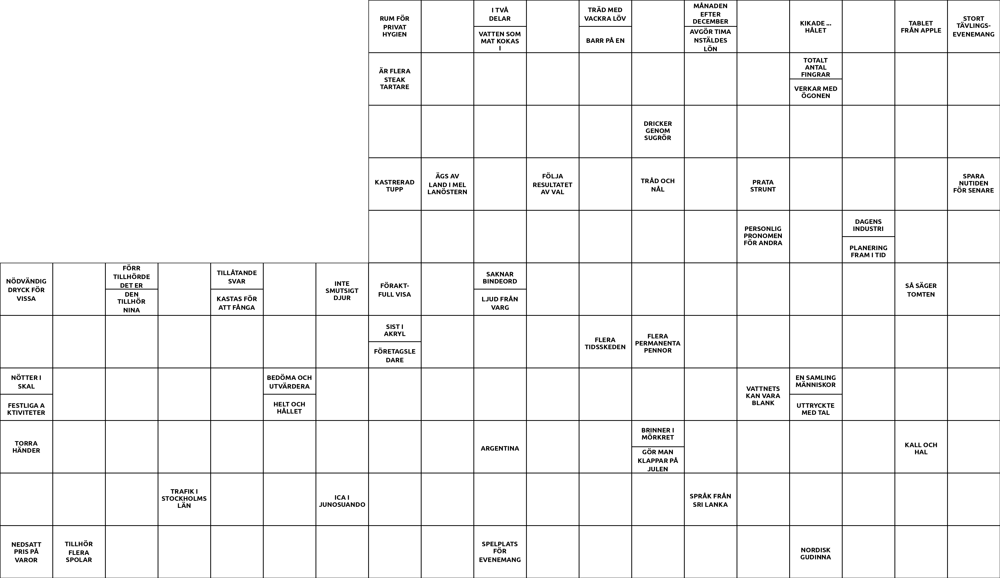

# Korsord

```bash
korsord [OPTION...] [MODEL] [WORDS...]
```

You can only generate a grid from one model at a time, but you can tell the program to pick words from multiple word lists. The used words will be prioritized based on the inputted order. In the following example, `my.words` will be prioritized over `other.words`.

```bash
korsord my.model my.words other.words
```

## <span>clues.py</span>

The clues should be written after the clue-seperator `:` after each word on each line. If you want help with ideas to clues, or just don't bother, you can let ChatGPT write them for you.

```bash
python clues.py [OPTION]
```

This script will ask ChatGPT to generate clues for each word and write them correctly to the *result.words* file. After the AI has written it's answers, you can always edit them or let the AI try one more time, until you're satisfied with the clues.

Paste OpenAI api key in this file:

```bash
binary/api.key
```

## <span>render.py</span>

```bash
python render.py [OPTION]
```

The rendered images of the crossword will by default be stored in a new folder in the `results` directory:

`korsord.png` Squares are drawn and clues are written before each word

`helping.png` Additional random numbers are written in each letter square, grouping equal letters

`solved.png`  Finally, all the correct letters are filled, showing the solution

<div style="display: flex; justify-content: space-between;">
    <div style="flex-direction: row; width: 30%; text-align: center;">
        
        <span class="caption">normal.png</span>
    </div>
    <div style="flex-direction: row; width: 30%; text-align: center;">
        
        <span class="caption">helping.png</span>
    </div>
    <div style="flex-direction: row; width: 30%; text-align: center; ">
        
        <span class="caption">solved.png</span>
    </div>
</div>
